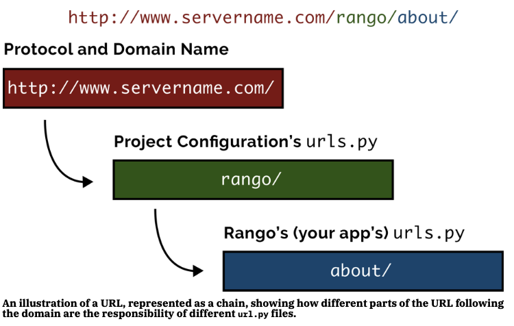

# CHAPTER 3: Django Basics
## Overview:
### Creating a new Django Project
1. To create the project, run `python django-admin.py startpoject <name>` where `name` is the name of the project you wish to create
### Creating a new Django App
1. To create a new app, run `python manage.py startapp <appname>`, where <appname> is the name of the app you wish to create
2. Tell your Django project about the new app by adding it to the `INSTALLED_APPS` tuple in the project's `settings.py` file
3. In the project `urls.py` file, add a mapping to the app
4. In your app;s directory, create a `urls.py` file to direct incoming URL strings to views
6. In your app's `view.py`, create the required views ensuring that they return a `HttpResponse` object
## 3.1: Testing Your Setup
- Check that you have the right versions of Python and Django in the virtual environment
- Check that django can be imported by quickly testing it in the Python interpreter
`
python 
\>\>\>
\>\>\> import django
\>\>\> django.get_version()
\'3.7.7\'
\>\>\> exit()
`
## 3.2: Creating Your Django Project
- To create a new Django project, go to the workspace directory and enter:
    `django-admin.py startproject tango_with_djang_project`
- Running this command creates a new project directory with two items:
    1. a nested directory with the same name as the main project
    2. A python script manage.py
- The subdirectory (for the sake of this tutorial) the *project configuration directory*
    - This directory has four scripts:
        1. `__init__.py`: an empty script that indicates to Python that the directory is a Python package
        2. `settings.py`: stores all of the project's settings
        3. `urls.py`: stores all URL patterns for the project
        4. `wsgi.py`: helps run a development server and deploy the project to a production envrionment
- `manage.py` is a script that provides a series of commands to help maintain the project
    - The script can allow you to run a built-in development server, test the application, and run database commands
    - We'll use this script for virtually every Django command we want to run
    - Running `python manage.py runserver` will result in the development server being hosted at the outputted local server
    - You can change the settings for the development server, like running it on a different port or allowing other users to access it from another machine through optional arguments
    - The following command will force the server to respond to requests on TCP port 5555
    `python manage.py runserver <your_machines_ip_address>:5555`
        - If you don't know your IP address, you can put 0.0.0.0 and Django will fill it for you 
        - Unliekely that you can use TCP port 80 or 8080 as they are usually reserved for HTTP traffic, and any port 1024 and below is considered to be privledged by your OS
    - Doing this will help you test the site on other machines in your network

## 3.3: Creating a Django App
- Django projects are a collection of *configurations* and *apps* that together make up a web app / website
    - This encourages making small apps that can be used across different Django projects
- A Django application exists to perform a particular task, where you need to make specific apps that are responsible for dierrent functionality on the site
    - Ex: One project has several apps, including a polling app, registration app, and a specific content related app. The polling and registration apps can easily be reused in other projects because they are decoupled from the project as a whole.
- `python manage.py startapp rango`
: `startapp` command creates a new app, which is a directory with the following files contained within:
    1. another `__init__.py`: again used to have python interpret this directory as a package
    2. `admin.py`: where you can register your models so  you can benefit from some Django machinery which creates an admin interface for you
    3. `apps.py`: provides a place for any app-specific configurations
    4. `models.py`: a place to store the app's data models, where you specifiy the entities and their relations between data
    5. `tests.py`: where you can store a series of functions to test your implementation
    6. `views.py`: where you store a series of functions that handle requests and return responses
    7. the `migrations` directory: stores database specific information related to the models
- `view.py` and `model.py` are used as the core functionality behind the app, serving in Django's main architectural design pattern of **Model-View-Template** 
- Before working on an app, you have to tell the project the app exists by **modifying the `settings.py` file**
    - Open the file and find the `INSTALLED_APPS` list and add the `rango` app at the end of the tuple
    - Ensure that the app is working properly by redeploying your development server, if no errors occur the app is working

## 3.4: Creating a view
- Views
: handle a *request* that comes from the client, *executes some code*, and provides a *response* to the client
    - A view may use other resources (think apps or dbs or models) to fulfill the request
    - The job of a view is to organize and package the data needed for a request
- All views are made in an app's `views.py` script 
    - Each view is a function with at least one argument, a `HttpRequest` object
    - Each view must return a `HttpResponse` object, where a simple `HttpResponse` object takes a string that represents the page to send to the client 
- For someone to see a view, you have to mape a URL to the view
- Go to `urls.py` in the project configurations directory and import the views script from the app your using (for tutorial sake, `rango`)
    - `from <app> import views`
- Then add the following to `urlpatterns`\: `path('', views.index, name='index'),`
    - This maps the basic URL to the `index` view defined in the `rango` app

## 3.5: Mapping URLs
- We can change how we map URLs to views to make the app more modular (and thus re-usable)
- First, modify the `urls.py` to have it point to the app for any specific app requests
    - Ex: `path('rango/', include('rango.urls')),` 
    - This maps any URLs starting with `rango/` to be handled by the rango app
- Then specify how the app will handle such requests
- The `urlpatterns` is a list in `urls.py`, and adding the above example looks for URL strings that match that pattern (through the use of regular expressions)
- When a match is made, the rest of the URL string is passed onto the app specificed in the `include()` function (which comes from the `django.urls` package)

- The chaining process first strips out the domain, leaving `/rango/about` and passed along to the `tango_with_django` project
- Then, `range/` is stripped, leavin `about/` to be handled by rango
- We need to create a new file called `urls.py` in the `rango` app directory to handle the remaining URL string 
- When we talk about URL strings, it is assumed the host portion has been stripped off already
    - Ex: Given `http://127.0.0.1:8000/rango/about`, Django will handle `/rango/about/` part of the URL string
- Django's `path` function takes a regex string to match, what view to call if the string is matched, and an optional *name*, which provides a convenient name to refer to the view and is useful later on for **reverse URL matching**, which allows you to reference the URL mapping by name rather than by the URL (which also will use the `app_name` variable
- Restart the dev server and visit the new app, and if all went well the app should display the view
- For now, the URL mappings are rather simple, but as the tutorial moves on move complex and parameterised URL mappings will be implemented
